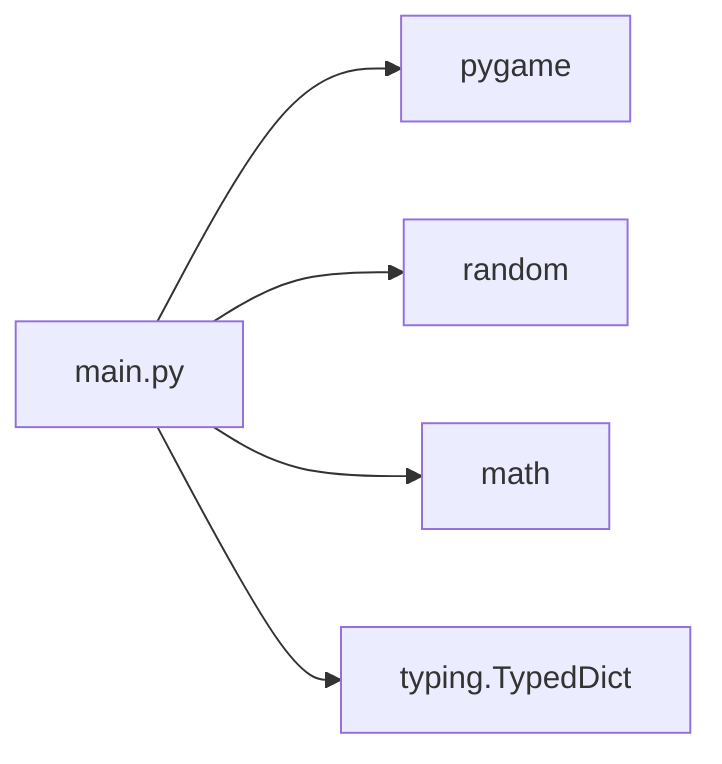
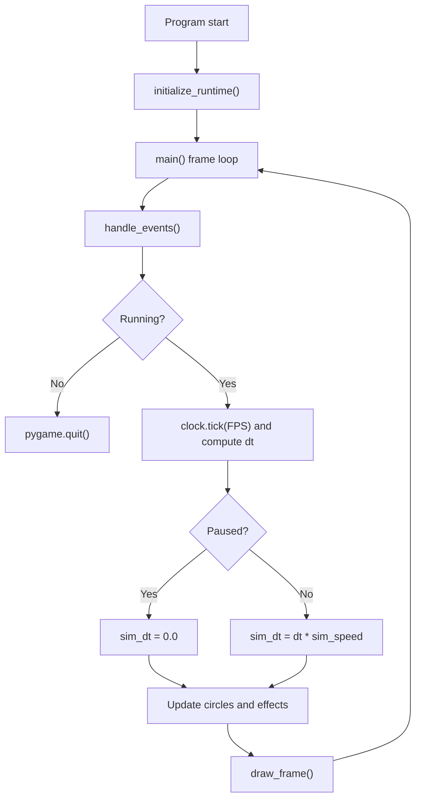
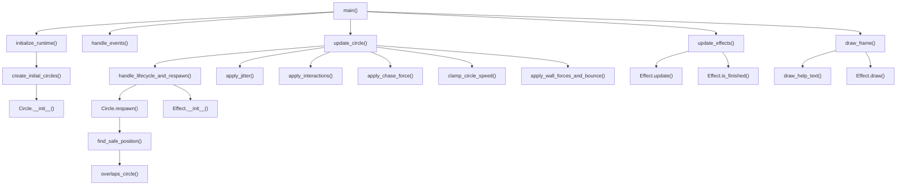
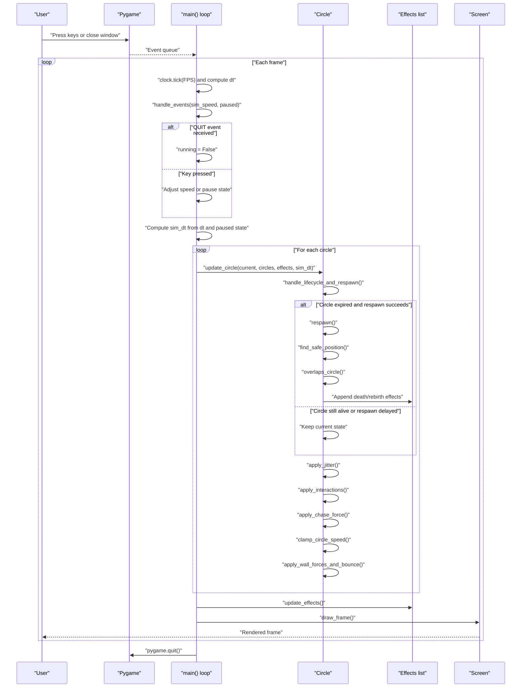

# Architecture Overview

This project is a single-module Pygame simulation. The runtime behavior lives in [main.py](../main.py), and the rest of the repository is documentation and notes.

## Module Dependency Graph

`main.py` is the only runtime module. It imports Pygame for rendering and input, and standard-library utilities for randomness, geometry, and typed data.

## Runtime Flow

The loop is intentionally simple: process input, advance simulation time, update entities, render the frame, and repeat until the user quits.

## Function-Level Call Graph

The important internal path is the circle update path: life-cycle handling, steering, interaction resolution, speed clamping, and wall handling all happen once per circle every frame.

## Primary Execution Sequence

The primary path covers the real frame loop, including the respawn branch, optional effect creation, and the render step that presents the final frame.

## Notes

- `Circle` owns persistent state for radius, color, position, velocity, and lifespan.
- `Effect` is a temporary helper for death and rebirth visuals.
- The simulation is frame-rate independent because all motion uses delta time.
- The codebase has no internal package split yet, so the architecture is centered on one file.
